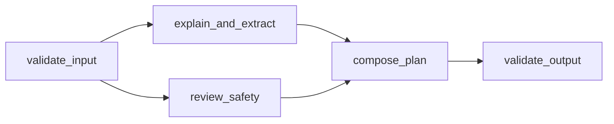

# Daywell

Daywell helps older adults understand everyday messages and turn chosen next steps into a practical daily plan. It is the Google PromptWars warmup app.

- Public app: https://promptwars-warmup-589901835092.asia-south1.run.app
- Repository: https://github.com/deevyanshoo/promptwars-warmup
- Service: `promptwars-warmup`, project `promptwars-divyanshu-260919`, region `asia-south1`.
- Branch: `main` only. No event submission is performed by this project.

## Run locally

Use Node.js 22 and the prepared Google Application Default Credentials with Vertex AI access. Credentials stay outside this repository.

```sh
npm ci
export GOOGLE_CLOUD_PROJECT=promptwars-divyanshu-260919
export GOOGLE_CLOUD_LOCATION=global
export GEMINI_MODEL=gemini-3.8-flash
npm start
```

Open http://localhost:8080. `PORT` defaults to 8080; the server binds to `0.0.0.0`. `GET /health` returns service status and the deployed `APP_COMMIT` when configured. Health does not call Gemini.

## What works

- Paste up to 4,000 characters or use the clearly labeled appointment example. Two real server-side Gemini calls provide an explanation, manageable steps, preparation suggestions, questions, and an independent caution review.
- Select suggestions before adding them to My day. No task is saved automatically. Add manual tasks, choose or change optional dates, mark tasks as done, and delete them.
- On opening the page, see overdue, due-today, and upcoming counts plus the next incomplete task. Dates are compared as local calendar dates. Relative dates require clarification and all task dates are user-selected.
- Approved tasks and the text-size preference persist in this browser's localStorage. The pasted message and full AI response are not persisted. Approved tasks may retain AI preparation suggestions. Clear saved data is available with a confirmation.
- Responsive two-column desktop layout and message-first mobile layout. Native labeled controls, 20px default body text, larger-text mode, visible focus, keyboard operation, and optional browser speech synthesis with Listen and Stop reading.
- Honest loading and retry states. Both AI branches must succeed. Input remains visible after failures. No fake AI fallback.

## Actual backend DAG



`lib/dag.mjs` executes node declarations with `id`, `dependsOn`, and `async run(context, dependencyResults)`. It rejects duplicate IDs, missing dependencies, and cycles. Ready independent nodes launch concurrently. Each node runs at most once; only declared dependency outputs are passed to it. All request state is local to that execution. The deterministic join waits for both required AI results; a failed or invalid branch blocks the join and final validation. Each retry creates a new graph execution.

`validate_input` runs before any model call. `explain_and_extract` and `review_safety` independently receive the original untrusted message, use different system instructions and structured JSON schemas, and validate their results in application code. `compose_plan` retains cautions and questions. Substantial risk replaces all candidate steps with reviewer verification steps and omits preparation suggestions that might encourage acting on the request. `validate_output` enforces final types, field lengths, allowed risk values, and at most five steps. Generated dash punctuation is normalized deterministically without another AI call; pasted text is preserved.

The collapsed “How this was prepared” disclosure shows real completed, failed, or blocked node statuses and durations. It contains no model reasoning, prompts, credentials, or raw logs.

## AI and security limits

The only GenAI service is Google Gemini on Vertex AI, model `gemini-3.8-flash`, through pinned `@google/genai` **2.23.0** with `vertexai: true`, global model endpoint and thinking level `LOW`. Every valid accepted explanation uses exactly two independent calls, with 2,200 output tokens per branch, one SDK attempt, a 40-second upstream timeout, and a 45-second workflow deadline. There are at most two active workflows and four active SDK calls per process. Global admission is capped at 20 requests per minute per process; excess requests receive HTTP 429 and Retry-After. Request bodies are capped at 20 KB. Cloud Run is capped at one instance; these in-memory limits reset when an instance restarts.

No login, database, additional AI provider, link fetching, tools, external actions, credentials in browser code, or background notifications. Pasted content is untrusted data and model text is rendered through textContent, never HTML. Strict same-origin CSP, no CORS permission, cross-site browser POST rejection, bounded fields, fixed static-file routes, and non-root container runtime reduce exposure. Application logs record only failure categories, not pasted text or model output. Managed infrastructure may retain request metadata. Google processes the message, as stated before submission.

The model can be wrong, miss risk indicators, or produce unsuitable advice. Review signals do not guarantee safety and are not definitive scam verdicts. Important medical, financial, and appointment details need independent confirmation. Browser data is accessible to people using the same browser profile and does not sync between devices. Speech availability and processing depend on the browser and operating system. Cancelling an SDK request does not guarantee provider-side compute has stopped. This short-lived public demo has basic throttling, not production abuse protection.

## Tests and deployment

```sh
npm test
```

The focused Node test suite checks concurrent branches, join ordering, dependency-only outputs, at-most-once execution, failure blocking, graph validation, execution deadlines, request isolation, invalid input without AI calls, malformed model output, risk-based replacement, date cues, HTTP errors, and throttling. Live browser and public deployment checks are documented in `VERIFICATION.md` when complete.

Deployment uploads only package manifests, Dockerfile, server, library, and public assets. Credentials, dependencies, tests, screenshots, recordings, and local environments are excluded.

```sh
gcloud run deploy promptwars-warmup \
  --source . --project promptwars-divyanshu-260919 --region asia-south1 \
  --build-service-account projects/promptwars-divyanshu-260919/serviceAccounts/promptwars-build@promptwars-divyanshu-260919.iam.gserviceaccount.com \
  --service-account promptwars-runtime@promptwars-divyanshu-260919.iam.gserviceaccount.com \
  --allow-unauthenticated --min 0 --max 1 --cpu 1 --memory 512Mi --cpu-throttling \
  --concurrency 8 --timeout 60 \
  --set-env-vars GOOGLE_CLOUD_PROJECT=promptwars-divyanshu-260919,GOOGLE_CLOUD_LOCATION=global,GEMINI_MODEL=gemini-3.8-flash,APP_COMMIT=YOUR_COMMIT
```

The existing readiness service remains private and unchanged. See `DEMO.md` for a 60 to 90 second walkthrough.
